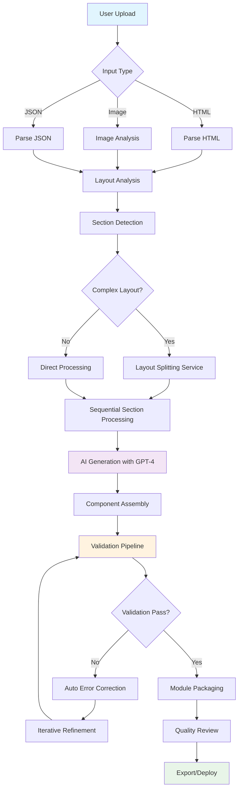
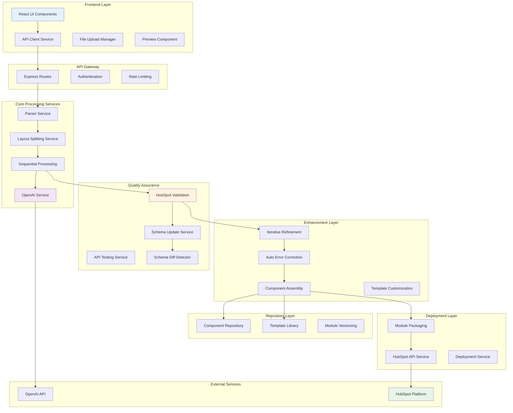
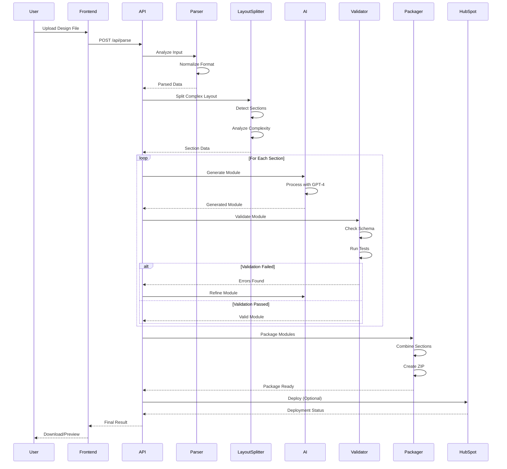
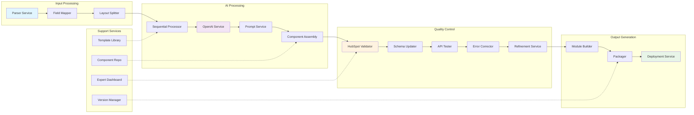
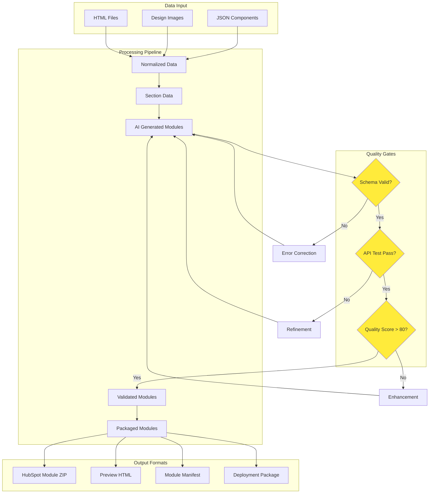
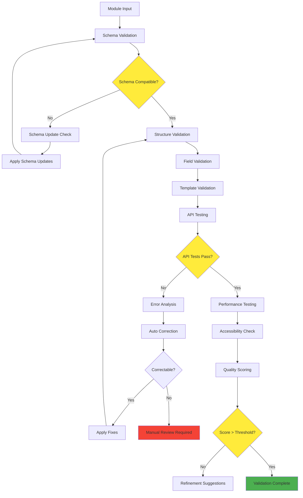
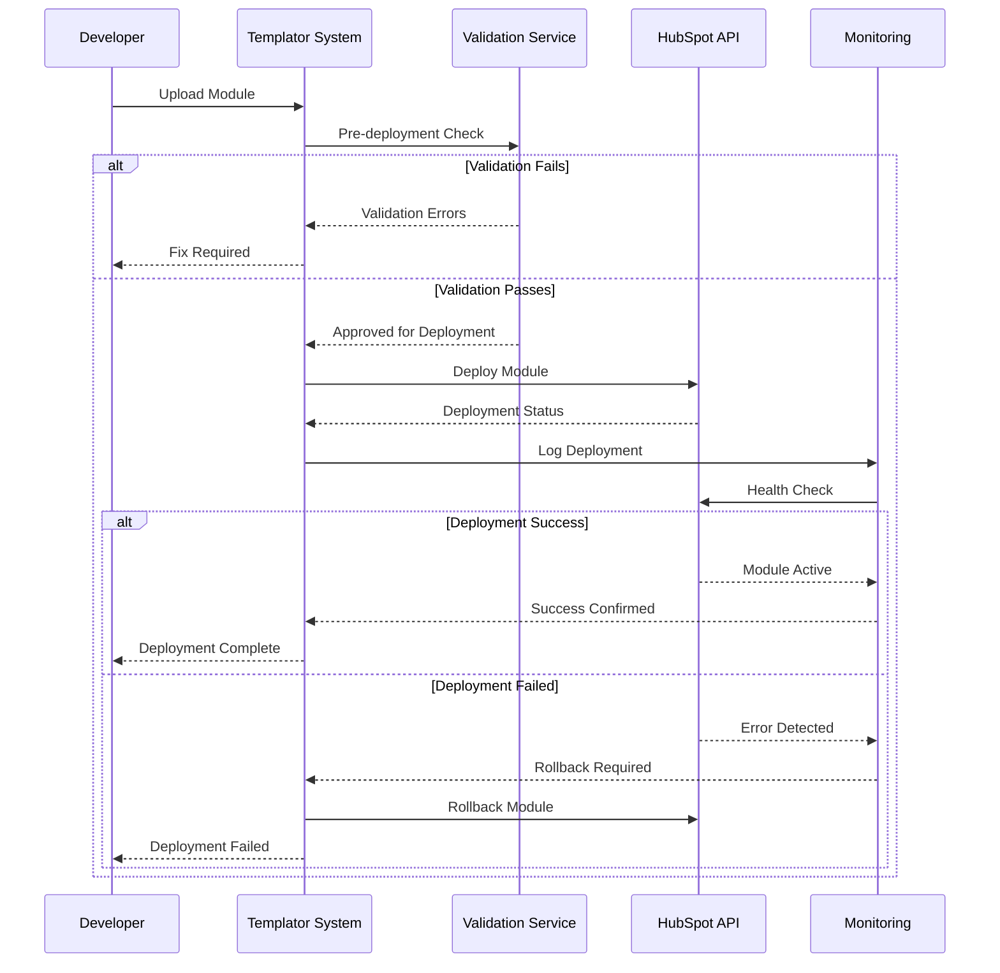
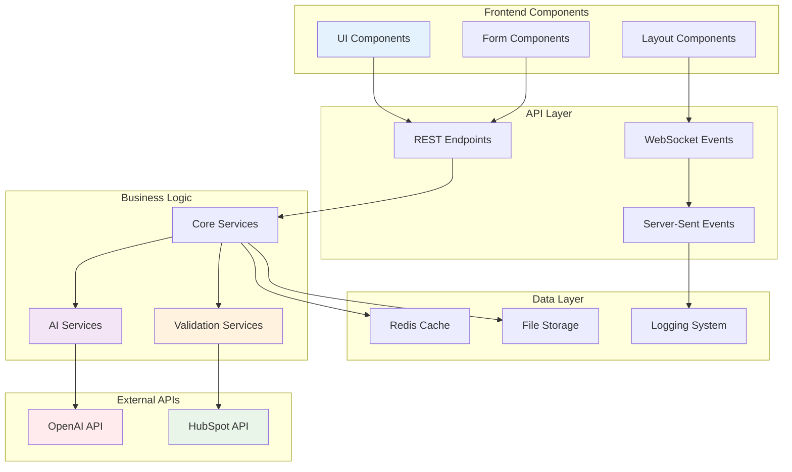
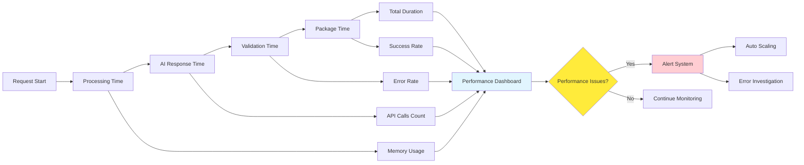

# Templator Project - Visual Flow Diagrams

## 🎯 Main Process Flow

## 🏗️ System Architecture Overview

## 🔄 Detailed Processing Pipeline

## 🧩 Service Interaction Map

## 📊 Data Flow Architecture

## 🔧 Validation Pipeline

## 🚀 Deployment Flow

## 🎛️ Component Interaction Matrix

## 📈 Performance Monitoring Flow

These visual flow diagrams provide a comprehensive view of the Templator system's architecture, data flow, and process interactions. Each diagram focuses on different aspects of the system to help understand the complete workflow from user input to final module deployment.
